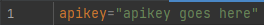
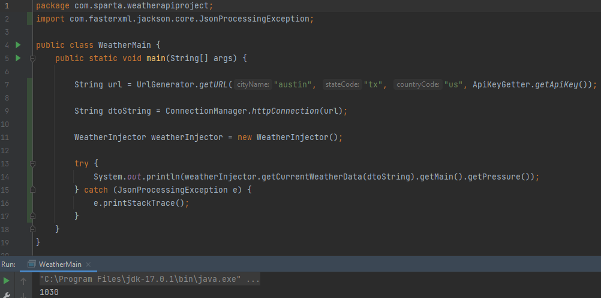
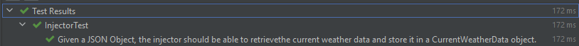
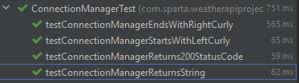
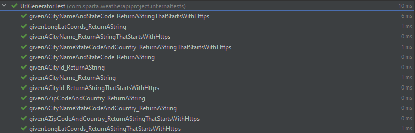

# WeatherApiProject
This project involved the creation of a testing framework to test the Open Weather Map API. The framework is only focused on the Current Weather section of the Api. The framework is designed to be used by a third party looking to test the OpenWeatherMap current weather api.
## About
Main features of the project framework:
- **API used: https://openweathermap.org/current**
- **The framework created using JUnit and Jackson.**
- **Agile Framework: Scrum**

### Project Architecture
This project will follow a Service Object Model:
- DTO: Classes that represent the different types of responses that can be called.
- ConnectionManager: A class which handles the connection to the live system and collecting the response.
- Injector: A class responsible for injecting the JSON response into a weather DTO.

## The Team
- Brandon Johnson - Testing
- Autumn Pelešová- Testing
- Ben Wong - Development
- Antony Ademefun - Development
- Natasha Reilly - Scrum Master

## Tools Used
- JUnit
- Java
- Jackson
- Git
- Maven
- Mockito
- Cucumber

## GitHub Rules
- All code to be added to the main branch must be production ready and approved by all members of the group
- Each pull request needs at least 2 approvals
- Each branch has the format: [your name]_[the feature you're working on]

## How To Use
#### Api Key Set Up
Before the testing framework can be used, an api key must be retrieved from https://openweathermap.org/. Simply create an account and navigate to https://home.openweathermap.org/api_keys once logged in.

In the root directory of the repository create a new file called apikey.properties and create a variable on the first line called apikey. The image below shows the format of this properties file.
######

######
Replace "apikey goes here" with the generated api key from OpenWeatherMap. This api key can be retrieved using the *getApiKey* method inside the ApiKeyGetter class when a response from the api is needed.
#### Creating a URL
Once an api key has been set up, a URL must be created. This is done by using the static method *getURL* in the UrlGenerator. There are 6 choices of input into the Url generator, and each is a different way of specifying the location then used to find the weather for. Each different input type uses the api key as the final constructor input. The 6 input types are shown below:
- City name (String)
- Longitudinal coordinate (double), Latitudinal coordinate (double)
- City name (String), State code (String)
- City name (String), State code (String), Country code (String)
- City ID (int)
- Zipcode (int), Country code (String)

Example code that generates a Url might be as follows:
```java
String url = UrlGenerator.getURL("austin", "tx", "us", ApiKeyGetter.getApiKey());
```
#### Connection Manager
This Url is used as the input for the *httpConnection* method in the ConnectionManager class. This method outputs the JSON response as a string to then be used by the WeatherInjector class.
#### Weather Injector
To retrieve specific data from the api, the WeatherInjector class is used. After instantiating the WeatherInjector each of the Jackson generated classes can be called with get methods. Each of these classes have multiple get methods to get the specific data required.

An example of a basic use of the framework is shown below, the current pressure (hPa) for Austin Texas is retrieved using the api and printed to the console.
######

######
## Example Tests Using the Framework
To mimic the use of the framework by a third party tester, example code was created in JUnit and Cucumber to test the api. These JUnit examples are in the test directory in the package com.sparta.weatherapiproject, titled "ExampleTests". The Cucumber examples are also in the test directory in the resources' folder.
## Internal JUnit Testing
To ensure the framework works as intended, internal JUnit tests were carried out on the classes used to generate the response. In some cases Mockito was used to replicate a consistent result from the api. The testing results are shown below.
######

######

######

######


## Review
Overall the project is considered a success, a functioning framework is created that a third party can easily use to test the OpenWeatherMap api. To improve upon the project the calling of the response could potentially be streamlined and an inclusion of a unit selection feature to better represent the needs of the api tester. 
